# cue-rs

Rust bindings for the [CUE](https://cuelang.org) language runtime, built as a wrapper around [libcue](https://github.com/cue-lang/libcue) — the official C interface to the CUE Go runtime.

> [!WARNING]
> This library is experimental. The API is unstable and it is not recommended for production use.

[libcue](https://github.com/cue-lang/libcue) exposes the CUE evaluation engine (written in Go) as a C API via cgo. The build script compiles it into a static archive (`libcue.a`) which is then statically linked into the Rust crate, exposing a safe Rust API on top.

```mermaid
flowchart TD
    subgraph libcue ["libcue (libcue.a)"]
        Go["🐹 Go (CUE runtime)"]
        C["⚙️ C interface (cgo)"]
        Go --> C
    end

    libcue -->|"statically linked"| Rust["🦀 Rust"]
```



## Requirements

- **Go 1.24+** — the Go toolchain is required.

## Usage

```rust
use cue_rs::{Ctx, Value};

let ctx = Ctx::new().unwrap();
let v = Value::compile_string(&ctx, r#"{ name: "alice", age: 30 }"#).unwrap();

v.is_valid().unwrap();
println!("{}", serde_json::from_slice::<serde_json::Value>(&v.to_json_bytes().unwrap()).unwrap());
```

## Examples

More examples can be found in the [`examples/`](examples/) directory.
