# cue-rs

Rust bindings for the [CUE](https://cuelang.org) language runtime.

The CUE evaluation engine is written in Go with the C interface. Staticly linked with the `Rust` code, exposing a safe `Rust` API on top.

```mermaid
flowchart TD
    subgraph go-cue ["go-cue (libgo_cue.a)"]
        Go["🐹 Go (CUE runtime)"]
        C["⚙️ C interface"]
        Go --> C
    end

    go-cue -->|"statically linked"| Rust["🦀 Rust"]
```



## Requirements

- **Go 1.21+** — the Go toolchain is required.

## Usage

```rust
use cue_rs::value::Value;

let v = Value::new(r#"{ name: "alice", age: 30 }"#).unwrap();

println!("{}", v.to_json_string().unwrap());
println!("{}", v.to_yaml_string().unwrap());
```
